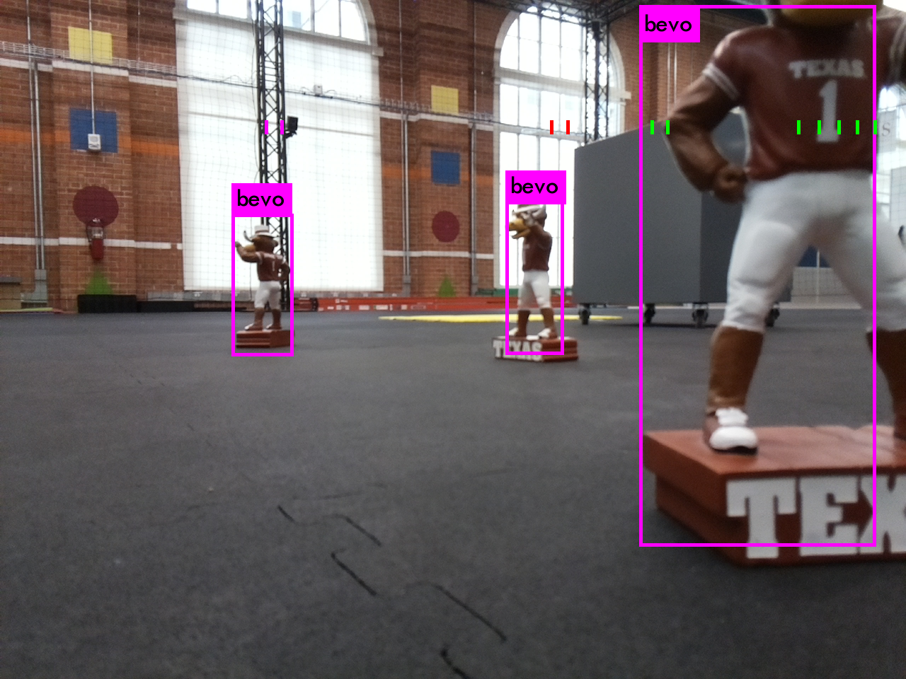

.. turtlebot-detect-slam documentation master file, created by
   sphinx-quickstart on Thu Feb 25 11:45:16 2021.
   You can adapt this file completely to your liking, but it should at least
   contain the root `toctree` directive.

Using a Turtlebot3 for SLAM and object detection
================================================

.. toctree::
   :maxdepth: 2
   :caption: Contents:

`Turtlebot detect slam <https://github.com/u-t-autonomous/turtlebot-detect-slam/>`_ is a ROS package designed for use with a `Turtlebot3 Waffle Pi <https://www.robotis.us/turtlebot-3-waffle-pi/>`_. The package utilizes the Turtlebot's camera and lidar sensor to associate lidar points with objects detected by the camera. This data is then processed to form a local map of the objects. Developed for research done by UT Austin's `Autonomous Systems Group <https://www.oden.utexas.edu/research/centers-groups/asg/>`_. This guide also contains instructions for running the package in a `Gazebo <http://gazebosim.org>`_ world.

    

Indices and tables
==================

* :ref:`genindex`
* :ref:`modindex`
* :ref:`search`
